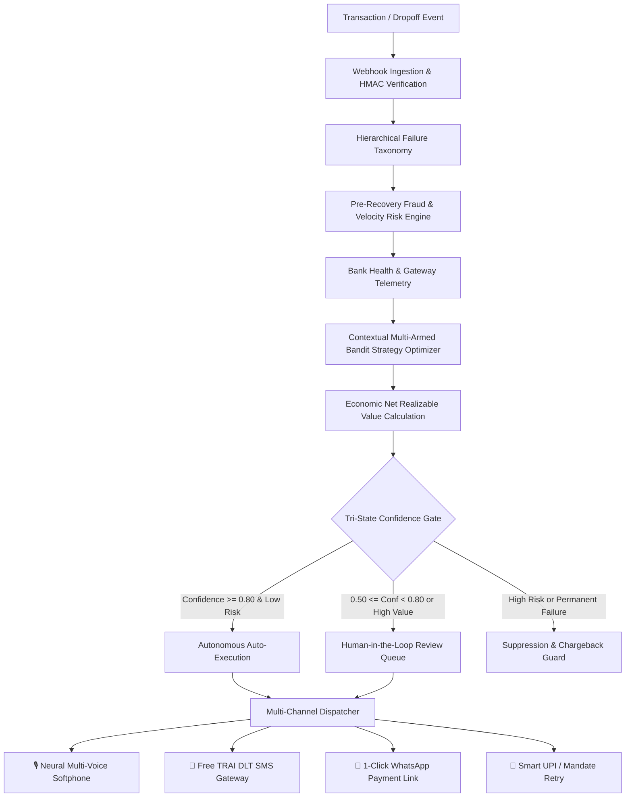

# RevPilot — AI Revenue Recovery Platform

> **Autonomous, Risk-Aware, Multi-Channel Payment Recovery & Revenue Intelligence Engine**  
> **Direct Local Execution — 100% Free Demo APIs — Zero External Telephony/Docker Dependencies**

[](https://fastapi.tiangolo.com/)
[](https://nextjs.org/)
[](https://www.sqlite.org/)
[](https://www.python.org/)
[](https://opensource.org/licenses/MIT)

---

## 🌟 Executive System Overview

**RevPilot** is an enterprise-grade AI revenue recovery and autonomous financial optimization platform built for modern merchants, high-growth D2C brands, B2B enterprises, and payment aggregators.

Instead of naive, hardcoded blind retries that trigger bank penalties, customer fatigue, and high transaction costs, RevPilot implements an **explainable, risk-gated Economic Recovery Pipeline**:

$$\text{ENRV} = (\text{Amount} \times P_{\text{recovery}}) - (\text{Comm Cost} + \text{Acquirer Fee} + \text{Customer Churn Risk})$$



---

## 🚀 Quick Start (Zero Docker Required)

RevPilot runs directly on your local system with standard Python and Node.js environments.

### 1. Prerequisites
- **Python 3.10+** (FastAPI, SQLAlchemy, Pydantic, scikit-learn, numpy, pandas)
- **Node.js 18+** & **npm** (Next.js 14, React 18, Tailwind CSS, Lucide Icons, Recharts)
- **Database**: SQLite embedded (`revenue_recovery.db`) — zero setup needed.

### 2. One-Click Launch Commands

#### Start Backend (FastAPI on Port 8000)
```bash
cd backend
python3 -m uvicorn app.main:app --host 0.0.0.0 --port 8000 --reload
```

#### Start Frontend (Next.js on Port 3000)
```bash
cd frontend
npm run dev
```

#### Seed Synthetic Enterprise Data (Optional)
```bash
python3 data/generator.py
```

---

## 🌐 Local Deployment — Application Endpoints & Port Map

When you deploy RevPilot locally on your machine, all services, interactive softphones, analytics dashboards, and REST endpoints are immediately accessible at the following URLs:

| Service | URL | Description |
|---|---|---|
| 🖥️ **Web Control Center** | [http://localhost:3000](http://localhost:3000) | Full Next.js React Dashboard, Analytics & Ledgers |
| 🎙️ **Voice Recovery Softphone** | [http://localhost:3000/recovery/voice-agent](http://localhost:3000/recovery/voice-agent) | 5 Neural Personas, Live Player & Outbound Queue |
| 📱 **SMS Recovery Gateway** | [http://localhost:3000/recovery/sms-gateway](http://localhost:3000/recovery/sms-gateway) | Free Demo SMS Dispatcher & Mobile Device Mockup |
| 🔐 **Authentication & Login** | [http://localhost:3000/login](http://localhost:3000/login) | 1-Click Demo Logins for 5 Personas & SMS OTP |
| 🏥 **Bank Health Telemetry** | [http://localhost:3000/analytics/bank-health](http://localhost:3000/analytics/bank-health) | Live Acquirer Success Rates & Downtime Alerts |
| 🎰 **MAB Strategy Optimizer** | [http://localhost:3000/strategies/bandit](http://localhost:3000/strategies/bandit) | Contextual Multi-Armed Bandit Performance |
| ⚡ **FastAPI REST Server** | [http://localhost:8000](http://localhost:8000) | High-Performance Asynchronous Python Microservice |
| 📖 **Interactive Swagger Docs** | [http://localhost:8000/docs](http://localhost:8000/docs) | Complete Interactive OpenAPI Testing Suite |
| 🩺 **System Health Probe** | [http://localhost:8000/api/v1/health-monitoring/status](http://localhost:8000/api/v1/health-monitoring/status) | Real-time Gateway & DB Telemetry Health |

---

## 💎 Key Platform Features & Modules

### 1. 🎙️ Neural Multi-Voice AI Recovery Agent & Call Vault
- **5 Distinct Indian Neural Voice Personas**:
  - 👩‍💼 **Priya (`en-IN-NeerjaExpressiveNeural`)**: Empathetic Priority Care Specialist.
  - 👨‍💼 **Rahul (`en-IN-PrabhatNeural`)**: Authoritative Enterprise Recovery Lead.
  - 🇮🇳 **Swara (`hi-IN-SwaraNeural`)**: Natural Bilingual Hinglish Specialist.
  - 🎙️ **Madhur (`hi-IN-MadhurNeural`)**: Calm Bank Timeout Specialist.
  - 🌸 **Kavya (`mr-IN-AarohiNeural`)**: Melodious Gentle Resolution Desk Specialist.
- **Audio Asset Vault**: 35+ studio-mastered neural `.mp3` audio files bundled in `frontend/public/audio/voices/`.
- **Call Recording Ledger**:
  - In-browser interactive audio player with real-time waveform frequency bars.
  - Direct 1-Click `.mp3` recording download.
  - Forensic bilingual Hinglish and English transcripts.
  - Guaranteed SQLite recording persistence (`POST /api/v1/voice/call/save-recording`).
- **Outbound Calling Worklist**:
  - Synchronized directly with **🔴 Failed Payment Retries** and **🟡 Pending Debits**.
  - 1-Click **"📞 Call Customer"** action that pre-loads customer metadata into the softphone.
- **Interactive IVR / DTMF Support**:
  - **Key 1**: Dispatches 1-Click WhatsApp payment link and marks call as `RECOVERED`.
  - **Key 2**: Captures Promise-to-Pay (PTP) commitment and marks call as `PTP_COMMITTED`.
  - **Key 3**: Escalates to human supervisor desk.

### 2. 📱 Free Demo SMS Gateway (₹0.00 Demo Telephony)
- **Pre-Approved TRAI DLT Templates**:
  - `cart_recovery` (D2C checkout drop-off recovery)
  - `payment_retry` (Instant UPI retry link)
  - `login_otp` (Two-factor authentication)
  - `invoice_dunning` (B2B overdue invoice alert)
- **Multi-Provider Dispatcher**: Mock carrier simulator with simulated delivery callbacks (`delivered`, `bounced`, `read`).
- **Interactive Smartphone Device Mockup**: Real-time visual representation of customer device receiving instant SMS nudges.

### 3. 🔐 Enterprise Authentication & Role-Based Access Control (RBAC)
- **6 Fine-Grained Operational Roles**:
  - `admin`: Full administrative control and rule configuration.
  - `revops`: Autonomous workflow authoring and strategy tuning.
  - `finance`: Ledger reconciliation, PTP audit, and settlement reporting.
  - `risk`: Velocity limits, fraud scoring thresholds, and suppression rules.
  - `agent`: Softphone dialer, manual customer outreach, and PTP logging.
  - `auditor`: Read-only forensic inspection and compliance audit trails.
- **1-Click Demo Personas**: Instant one-click authentication for fast demonstration without password friction.
- **Free SMS OTP Login**: Fully working 6-digit OTP verification via Demo SMS API.

### 4. 🧠 Intelligence, Risk & Economic Decision Engines
- **Hierarchical Failure Taxonomy (`app/failure_classifier.py`)**: Distinguishes between Temporary Network Timeouts, Customer Balance Drops, 3DS Authentication Drops, and Permanent Hard Blocks.
- **Pre-Recovery Risk Engine (`app/risk_engine.py`)**: Real-time velocity checks and fraud risk scoring to prevent chargeback spikes.
- **Bank & Gateway Telemetry (`app/routes/health_monitoring.py`)**: Real-time monitoring of HDFC, ICICI, SBI, Axis, and Razorpay success rates with circuit breaker routing.
- **Contextual Multi-Armed Bandit (`app/bandit_engine.py`)**: Reinforcement learning algorithm (UCB1) dynamically allocating recovery volume to top-performing channels.
- **Monte Carlo 2.0 Forecaster (`app/forecasting_engine.py`)**: 1,000 randomized simulation paths projecting 7-day, 30-day, and 90-day recovery yields across Worst, Expected, and Best-case scenarios.
- **Standardized AI Decision Object**: Immutable, explainable audit object attached to every single transaction.

---

## 🗺️ Complete Navigable Sitemap

```
├── 📊 Dashboard & Financial Operations
│   ├── / .................................... Executive KPI Overview & Funnel Analytics
│   ├── /recovery/opportunities .............. High-Yield Recovery Opportunities Queue
│   ├── /recovery/active ..................... Active Scheduled Retries & Recovery Operations
│   ├── /recovery/history .................... Immutable Financial Recovery Ledger
│   ├── /recovery/voice-agent ................ Neural Multi-Voice Softphone & Call Recordings
│   ├── /recovery/sms-gateway ................ Free Demo SMS Dispatcher & Smartphone Mockup
│   ├── /recovery/checkout-dropoff ........... Cart Abandonment & Pre-Payment Recovery
│   ├── /recovery/dunning .................... Subscription Churn & Salary-Cycle Dunning
│   ├── /recovery/b2b-chaser ................. B2B Overdue Invoices & Aging Matrix (DPD)
│   ├── /recovery/mandates ................... UPI Autopay & e-NACH Sequencer
│   └── /recovery/ptp-tracker ................ Promise-to-Pay Commitment Reliability Tracker
│
├── 📈 Intelligence & Diagnostics
│   ├── /analytics/payment-methods ........... Method-Level Breakdown (UPI, Card, NetBanking)
│   ├── /analytics/failures .................. Failure Spike Root-Cause Isolation
│   ├── /analytics/bank-health ............... Live Acquirer Telemetry & Downtime Monitor
│   ├── /analytics/forecast .................. Monte Carlo 1,000-Path Predictive Models
│   ├── /strategies .......................... Recovery Rule Builder & Multi-Channel Workflows
│   ├── /strategies/bandit ................... Contextual Multi-Armed Bandit (RL)
│   └── /experiments ......................... Multi-Variant A/B Conversion Experiments
│
├── 🛡️ Governance, Audits & Platform
│   ├── /transactions ........................ Forensic Transaction Deep-Dive Explorer
│   ├── /customers ........................... Customer LTV, Segments & Contact Windows
│   ├── /alerts .............................. Real-Time Financial Spike & Anomaly Alerts
│   ├── /webhooks ............................ HMAC Webhook Ingestion & Simulator
│   ├── /settings ............................ Confidence Thresholds & RBAC Matrix
│   └── /login ............................... 1-Click Demo Personas & SMS OTP
```

---

## 🧪 Automated Test Suite

RevPilot includes an automated test suite verifying all authentication flows, SMS DLT templates, multi-voice dispatchers, decision engines, and risk scoring pipelines:

```bash
# Run Auth, SMS & Voice Test Suite
PYTHONPATH=backend python3 backend/tests/test_auth_sms_voice.py

# Run Enterprise Architecture & Decision Engine Suite
PYTHONPATH=backend python3 backend/tests/test_revpilot_enterprise.py
```

### Verified Test Coverage
- ✅ TRAI DLT SMS templates and carrier simulator
- ✅ Multi-persona authentication & SMS OTP verification
- ✅ Multi-voice neural audio dispatch & DTMF state machines
- ✅ SQLite database persistence & call recording ledger sync
- ✅ Webhook HMAC-SHA256 signature verification
- ✅ Pre-recovery fraud scoring & velocity gates
- ✅ Contextual Multi-Armed Bandit UCB1 channel allocation
- ✅ Monte Carlo 1,000 simulation paths forecasting
- ✅ 6-Role RBAC permission enforcement

---

## 📜 License
This project is open-sourced under the **MIT License**.
