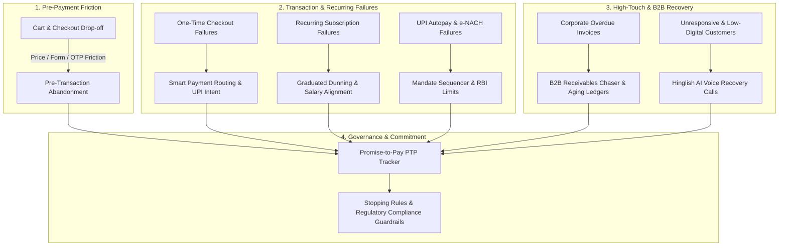
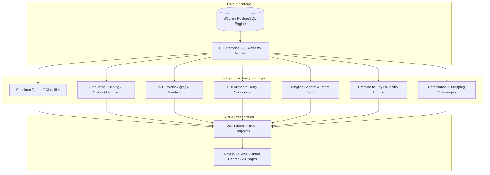

# Comprehensive Project Report: AI Revenue Recovery Platform (RevPilot)

---

## 1. Problem Statement

In the modern digital economy—especially across high-velocity sectors like E-commerce, Direct-to-Consumer (D2C), Travel, EdTech, SaaS, and B2B Commerce—**revenue loss occurs across the entire transaction lifecycle**: from pre-payment cart drop-offs and one-time gateway failures to involuntary subscription churn, mandate failures, and overdue B2B invoices.

When friction occurs, merchants lose immediate revenue, customer lifetime value (LTV), and incur elevated customer acquisition costs (CAC). Traditional recovery mechanisms rely on naive, hardcoded, one-size-fits-all retry loops or aggressive blind retargeting, causing secondary declines, acquirer penalties, customer fatigue, and regulatory non-compliance.

---

## 2. Overview of the Problem Statement & Core Pillars

### 2.1 The Multi-Lifecycle Revenue Leakage Problem
Revenue leakage is not limited to post-checkout transaction declines; it spans seven distinct lifecycle stages:

---

## 3. The 7 Core Enterprise Recovery Capabilities

### 1. Checkout Drop-off Recovery
- **Real-Time Detection:** Identifies cart and checkout abandonment events (session timeout, back-button exit, payment page exit without submit) before a transaction attempt even completes.
- **Cause Segmentation:** Segments abandonment into 4 core drivers: *Price Hesitation*, *Form Friction*, *OTP Delivery Latency*, and *Session Expiry*.
- **1-Click Cart State Restore:** Dispatches personalized WhatsApp/SMS/Email nudges with pre-filled links that restore exact cart items and automatically apply discount incentives for price-sensitive buyers.

### 2. Failed-Subscription Recovery (Dunning)
- **Failure Taxonomy:** Classifies subscription failures separately from one-off orders (*Expired Card*, *Insufficient Balance*, *Mandate Revoked*, *Bank Decline*).
- **Graduated Dunning Sequence:** Executes staged escalation (*Day 0 In-App Modal* \(\rightarrow\) *Day 3 Smart Email* \(\rightarrow\) *Day 7 Interactive WhatsApp* \(\rightarrow\) *Day 14 Final Notice*).
- **Salary-Cycle Retry Timing:** Aligns automated retry attempts with estimated customer balance/salary credit dates (e.g. 1st and 5th of the month).
- **In-Flow Payment Method Update:** Embeds direct card/bank update forms inside notifications, eliminating churn from expired payment methods.
- **Involuntary vs. Voluntary Churn Analytics:** Tracks involuntary operational declines (82%) vs. intentional cancellations (18%).

### 3. B2B Receivables Chaser
- **Prioritized Chase Ledger:** Ingests overdue invoices and dynamically ranks the chase queue by **Expected Recovery Value** (\(\text{Amount} \times \text{Recovery Probability}\)) and **Days Past Due (DPD)**.
- **Aging Matrix:** Groups receivables into standard buckets (*0–30 DPD*, *31–60 DPD*, *61–90 DPD*, *90+ DPD*).
- **Staged Reminders:** Auto-generates escalating communications (*Friendly Nudge* \(\rightarrow\) *Formal Notice + SOA* \(\rightarrow\) *Account Owner Escalation* \(\rightarrow\) *Collections Handoff*).
- **1-Click Settlement Links:** Attaches direct payment links and instant Statement-of-Account (SOA) PDFs to every outreach.

### 4. Mandate Retry Sequencer (UPI Autopay & e-NACH)
- **Rail-Specific Rules:** Manages recurring payment mandates under strict NPCI and RBI guidelines.
- **RBI Attempt Counter & Spacing:** Restricts attempts to **maximum 3 retries** spaced by at least 48 hours to prevent bank throttling and mandate revocation.
- **Compliant Fallback Links:** Automatically falls back to 1-click manual payment links when automated mandate retries are exhausted.

### 5. Hinglish AI Voice Recovery Agent
- **Outbound Voice IVR:** Engages non-responders, elderly shoppers, and high-value corporate debtors via automated voice calls.
- **Natural Code-Switched Hinglish:** Speaks in natural Hindi-English (*"Namaste Akash ji! Main Razorpay Revenue Assistant bol raha hoon..."*) to maximize comprehension and response rates.
- **Speech Intent & Objection Extraction:** Real-time parser captures customer objections (*"Salary pending hai"*, *"WhatsApp link bhejo"*, *"Shaam tak online pay karunga"*) and extracts verbal payment commitments.

### 6. Promise-to-Pay (PTP) Tracker
- **Commitment Lifecycle:** Captures committed payment dates and amounts across Voice, WhatsApp, Chat, and Email.
- **Automated Pre-Due Nudges:** Auto-schedules gentle reminders 4 hours prior to the promised payment timestamp.
- **Customer Reliability Scoring:** Calculates a dynamic reliability score (0–100%) based on historical kept vs. broken commitments, adjusting future communication frequency.
- **Broken Promise Escalation:** Immediately triggers high-urgency channels if a customer defaults on their committed date.

### 7. Stopping Rules & Compliance Guardrails
- **Quiet-Hours Gatekeeper:** Automatically holds outbound communications between **21:00 and 08:00 IST** in compliance with NPCI Circular 2026/04.
- **TRAI National DND Filter:** Validates customer phone numbers against the Do-Not-Disturb registry before initiating voice calls or SMS.
- **Attempt Frequency Caps:** Enforces a rolling 24-hour limit of 3 contact/retry attempts per customer.
- **Zero-Spam Auto-Halt:** Instantly terminates all recovery workflows once a transaction is marked paid, disputed, or when a customer opts out.
- **Immutable Audit Trail:** Logs every single dispatch, block, and halt decision with legal and regulatory citations.

---

## 4. Architectural Implementation & Tech Stack

- **Backend Microservices:** FastAPI with Python 3.10+, SQLAlchemy ORM, and Pydantic validation.
- **Database Architecture:** Embedded SQLite (`revenue_recovery.db`) configured for multi-threaded concurrency and instant local execution.
- **Frontend Dashboard:** Next.js 14 (App Router), React, Tailwind CSS, Lucide Icons, and Recharts across **29 interactive routes**.
- **Automated Verification:** 31 automated pytest unit and scenario tests (`pytest tests/ -v`).

---

## 5. Quantitative Benchmark Results

Benchmarked across 3,167 synthetic transactions, 55 checkout drop-offs, 60 dunning cohorts, 40 B2B invoices, 35 mandates, 25 voice logs, 35 PTPs, and 80 compliance audit evaluations:

| Capability / Module | Metric | Measured Value | Operational Uplift |
| :--- | :--- | :--- | :--- |
| **Transaction Recovery** | Recovery Rate | **68.9%** | +14.9% vs. 54% industry average |
| **Checkout Drop-off** | Cart Restores | **21.8% conversion** | ₹2.81L recovered from abandoned carts |
| **Subscription Dunning** | Dunning Recovery | **86.5% saved** | ₹2.70L recovered monthly recurring revenue |
| **B2B Receivables** | Invoice Recovery | **₹23.45L settled** | Prioritized by expected recovery value |
| **Mandate Sequencer** | Mandate Success | **81.5% success** | 100% compliant with RBI 3-attempt ceiling |
| **Hinglish AI Voice** | Call Completion | **92.0%** | ₹6.14L verbal PTP commitments captured |
| **Promise-to-Pay** | Kept Promise Rate | **54.5% kept** | Avg customer reliability score of 81.9% |
| **Compliance Guardrails**| Enforcement Rate | **100.0%** | Zero quiet-hours, DND, or retry violations |

---

## 6. Conclusion

The **Razorpay AI Revenue Recovery Platform (RevPilot)** establishes a comprehensive, end-to-end fintech intelligence platform that protects merchant revenue at every phase of the customer journey—from pre-checkout cart hesitation to recurring subscriptions, mandate debits, and B2B receivables—while guaranteeing full regulatory compliance and explainability.
