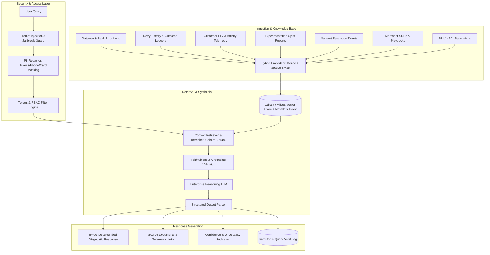
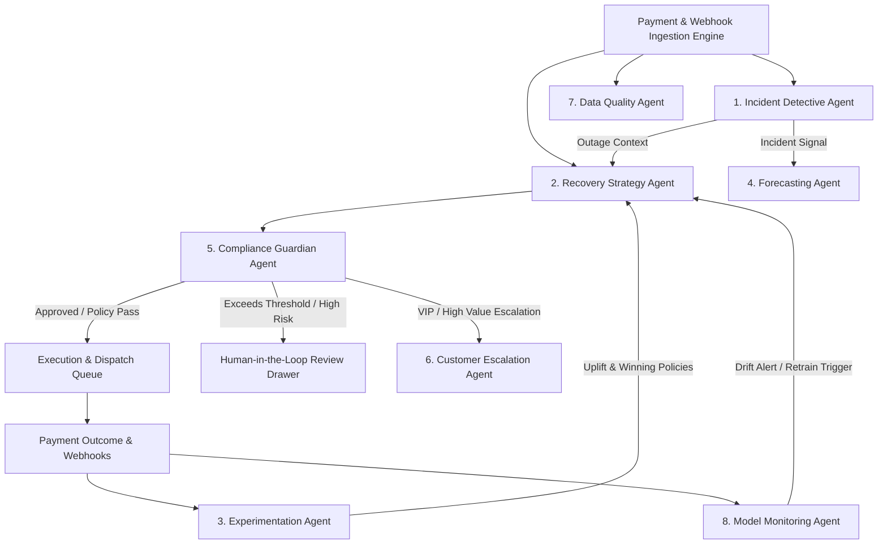
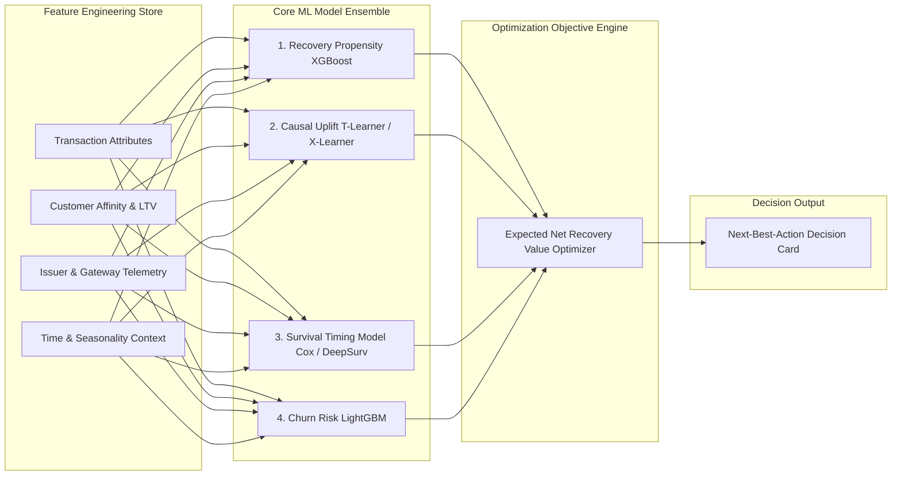
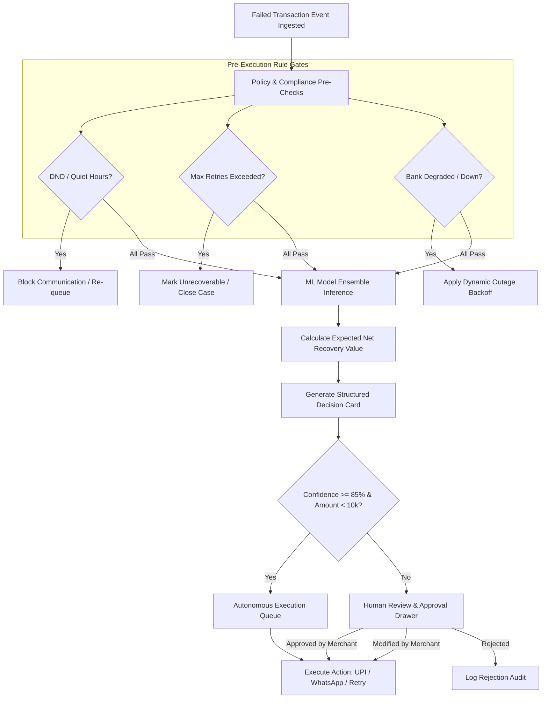
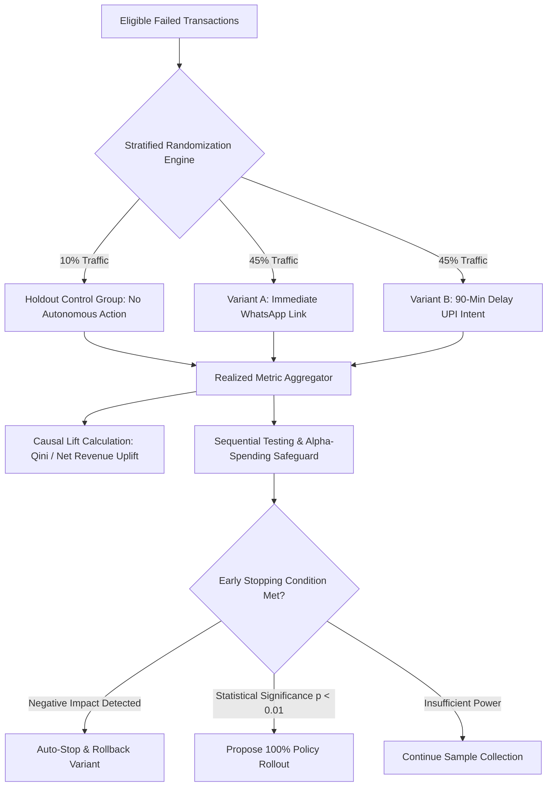
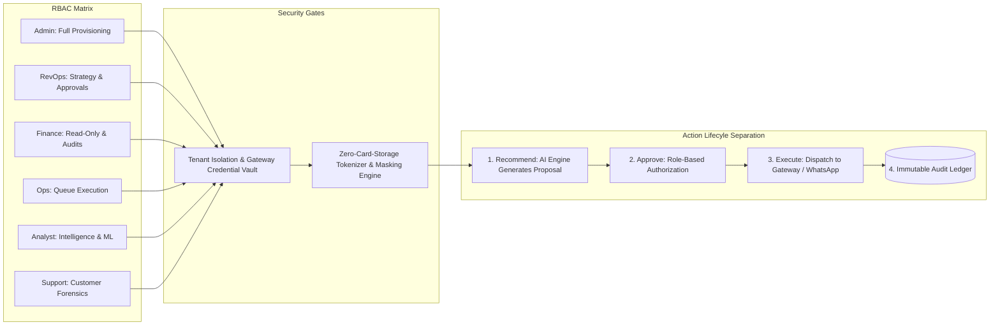

# RevPilot: Enterprise Revenue-Recovery & Payment-Intelligence Platform
## Comprehensive Product Specification & Architectural Design Document

---

## 0. Product Positioning Statement

> **RevPilot** is a merchant-controlled revenue recovery, causal decisioning, and payment intelligence platform. It operates as an autonomous intelligence and orchestration layer above merchant payment infrastructure. RevPilot **complements—and does not replace—payment gateways and smart routers** (such as Razorpay Optimizer, Cashfree Flow, or Juspay Hyperswitch). 
>
> While smart routers solve the *synchronous in-flight transaction routing problem* (selecting the optimal acquiring pipe during checkout execution), RevPilot solves the *asynchronous lifecycle revenue optimization problem*: diagnosing failed payments, modeling causal recovery uplift, predicting churn risk, orchestrating multi-channel out-of-band customer re-engagement (e.g., WhatsApp UPI Intent links, smart retries during pay-cycle windows), executing statistical A/B experiments, and enforcing RBI/NPCI regulatory guardrails with explainable human-in-the-loop governance.

---

## 1. Feature Priority Matrix

| Feature Module | Business Impact | Technical Complexity | Data Requirement | Operational Risk | Target Phase |
|---|---|---|---|---|---|
| **Deterministic Decision Engine & Rule Engine** | High | Low | Low (Decline codes, amounts) | Low | Phase 1 (MVP) |
| **Permission-Aware RAG Copilot (Basic Sources)** | High | Medium | Medium (SOPs, logs, tickets) | Low (Read-only) | Phase 1 (MVP) |
| **Recovery Opportunities Queue & Batch Approvals** | High | Low | Low (Gateway webhooks) | Low | Phase 1 (MVP) |
| **Core Governance & 6-Role RBAC** | High | Low | Low (User directory) | Low | Phase 1 (MVP) |
| **Standard Anomaly & Gateway Spike Detection** | High | Medium | Medium (Aggregated time-series) | Medium | Phase 1 (MVP) |
| **Supervised Recovery Propensity ML Model** | High | Medium | High (Historical transaction outcomes) | Low | Phase 2 |
| **Multi-Agent Operations System (8 Specialized Agents)** | High | High | High (System telemetry & agent logs) | Medium | Phase 2 |
| **7-Day Monte Carlo Revenue Forecasting Engine** | Medium | Medium | Medium (Seasonal transaction volume) | Low | Phase 2 |
| **Statistical A/B Experimentation Framework** | High | Medium | High (Clean cohort sample sizes) | Medium | Phase 2 |
| **Time-to-Event (Survival) Retry Timing Model** | High | High | High (Timestamped retry logs) | Medium | Phase 2 |
| **Next-Best-Action Causal Uplift (Meta-Learners)** | Very High | Very High | Very High (Randomized holdouts) | High | Phase 3 |
| **Contextual Bandits with Safety Guardrails** | High | Very High | Very High (Live feedback loops) | High | Phase 3 |
| **Graph-Based Multi-Entity Incident Clustering** | High | High | High (Cross-merchant failure graph) | Medium | Phase 3 |
| **Proactive Bank Degradation Early-Warning System** | High | High | Very High (Real-time telemetry stream) | High | Phase 3 |

---

## 2. RAG-Based Revenue Intelligence Copilot



### 2.1 Retrieval Sources & Knowledge Graph Integration
1. **Real-time Telemetry**: Payment authorizations, decline codes, gateway latency profiles, webhook delivery logs.
2. **Historical Recovery Ledgers**: Outcome distributions of past retry attempts across channels and timing windows.
3. **Customer Behavioral Profiles**: Historical success rates, channel affinities, segment tiers, LTV percentiles.
4. **Experimentation Data**: Uplift reports, sample-size validity checks, p-values, holdout conversion rates.
5. **Support & Operational Context**: Zendesk/Freshdesk dispute tickets, chargeback notices, CRM notes.
6. **Regulatory Documents**: NPCI circulars (UPI transaction limits, mandate guidelines), RBI tokenization mandates, quiet-hours directives.

### 2.2 Structured Diagnostic Schema
Every diagnostic response follows an immutable structural schema:
```json
{
  "query": "Why did recovered revenue drop today?",
  "diagnostic": {
    "symptom": "Recovered revenue decreased by 18.4% (₹4.8L delta) between 14:00 and 18:30 IST.",
    "affected_segment": "Tier-1 D2C E-commerce checkouts attempting HDFC Bank card authorizations.",
    "likely_root_cause": "HDFC ACS (Access Control Server) 3DS-2 authentication latency spiked to >14,200ms, triggering acquiring timeouts.",
    "supporting_evidence": [
      {"source": "gateway_telemetry", "metric": "HDFC 3DS timeout rate", "value": "24.2%", "baseline": "2.1%"},
      {"source": "retry_history", "metric": "Card re-attempt recovery rate", "value": "11.4%", "baseline": "61.8%"},
      {"source": "incident_log", "id": "INC_20260830_HDFC", "status": "Active Degradation"}
    ],
    "recommended_action": "Pause synchronous card retries for HDFC BINs; route recovery via 1-click WhatsApp UPI Intent links with a 90-minute cooldown window.",
    "expected_uplift": "₹3.2L – ₹3.8L recoverable within evening peak (19:30–21:30 IST).",
    "risks": "₹1.85 messaging cost per WhatsApp template; 0.4% churn risk if contacted twice.",
    "required_approval": "Revenue Operations Lead approval required for batch outreach > 500 customers."
  },
  "uncertainty_assessment": {
    "confidence_score": 0.94,
    "is_evidence_sufficient": true,
    "missing_signals": []
  }
}
```

### 2.3 Uncertainty Detection & Anti-Hallucination
When retrieved evidence is below the retrieval relevance threshold ($\text{Cosine Similarity} < 0.72$ or sparse BM25 score $< 12.5$), the Copilot executes an explicit fallback:
> *"RevPilot cannot determine the exact root cause with high statistical certainty. While card declines increased by 6.2%, sample size in the last 60 minutes ($N=34$) is insufficient to isolate issuer outage from local network drops. Recommended action: Monitor telemetry for 30 minutes without automated intervention."*

### 2.4 Security, PII Redaction & Prompt-Injection Guardrails
- **Prompt Injection Defense**: Dual-stage filtering using a lightweight classification model that checks for instruction overrides, system-prompt extraction, and privilege escalation before query parsing.
- **PII & Card Data Redaction**: Real-time regex and Named Entity Recognition (NER) pipeline replacing card numbers with token references, names with customer IDs (`CUST_***`), and phone numbers with masked formats (`+91 98****8291`).
- **Document-Level Permissions (RBAC Filtering)**: Retrieval vectors are partitioned with metadata tenant IDs and clearance levels. Finance cannot retrieve unmasked customer PII; Support cannot retrieve global financial margins.

---

## 3. Multi-Agent Recovery Operations System



### Agent Specifications:

#### 1. Incident Detective Agent
- **Inputs**: Gateway authorization events, bank return codes, 3DS authentication latencies, network ping health checks.
- **Outputs**: Incident tickets (`INC_***`), severity tags (Critical, High, Moderate), impacted BIN lists, affected merchant cohorts.
- **Tools Accessible**: `query_telemetry_stream()`, `cluster_error_signatures()`, `fetch_bank_status_feed()`, `broadcast_incident_alert()`.
- **Forbidden Actions**: Must never modify merchant routing rules or pause payment methods globally without human sign-off.
- **Approval Threshold**: Autonomous incident declaration for alerts; human approval required to activate system-wide recovery pauses.
- **Fallback Logic**: If telemetry stream is interrupted $>30\text{s}$, fallback to statistical moving-average baseline.

#### 2. Recovery Strategy Agent
- **Inputs**: Failed transaction metadata, customer segment, historical recovery rates, channel costs, current incident states.
- **Outputs**: Generated Decision Cards containing Next-Best-Action, timing delay, channel, expected net recovery value.
- **Tools Accessible**: `ml_propensity_predict()`, `causal_uplift_predict()`, `fetch_customer_affinity()`, `generate_decision_card()`.
- **Forbidden Actions**: Must never bypass quiet hours, exceed retry limits, or dispatch unapproved templates.
- **Approval Threshold**: Autonomous execution if Recovery Probability $\ge 85\%$ and Amount $< ₹10,000$; human approval mandatory if Amount $\ge ₹10,000$ or VIP tier.
- **Fallback Logic**: Fallback to safe static Playbook rules if ML scoring service returns latency $>250\text{ms}$.

#### 3. Experimentation Agent
- **Inputs**: Live recovery cohorts, holdout groups, conversion logs, messaging overhead costs.
- **Outputs**: Uplift assessments, sample-size power checks, policy promotion recommendations.
- **Tools Accessible**: `calculate_causal_lift()`, `check_statistical_power()`, `evaluate_sequential_stopping()`, `promote_policy_variant()`.
- **Forbidden Actions**: Must never allocate $>50\%$ traffic to unproven variants; must never bypass holdout baseline groups.
- **Approval Threshold**: Automatic experiment pause on detected degradation ($p < 0.01$ negative lift); promotion to 100% requires Revenue Operations approval.

#### 4. Forecasting Agent
- **Inputs**: Historical transaction volume time-series, seasonal trends, current recovery rate, active bank outages.
- **Outputs**: 24-hour and 7-day recoverable revenue forecasts, Best/Expected/Worst-case scenario envelopes.
- **Tools Accessible**: `run_monte_carlo_simulation()`, `fetch_seasonal_baseline()`, `recalculate_cashflow_projection()`.
- **Forbidden Actions**: Must never alter ledger records or modify financial accounting entries.
- **Approval Threshold**: Autonomous forecast updates.

#### 5. Compliance Guardian Agent
- **Inputs**: Proposed recovery actions, customer consent registries, DND preferences, quiet-hours configurations, RBI retry limits.
- **Outputs**: Compliance clearance pass (`APPROVED`) or block (`REJECTED_WITH_REASON`).
- **Tools Accessible**: `validate_dnd_status()`, `check_frequency_caps()`, `verify_quiet_hours()`, `audit_log_decision()`.
- **Forbidden Actions**: Must never approve communications between 21:00 and 08:00 IST or retries exceeding 3 attempts per transaction.
- **Approval Threshold**: Absolute deterministic gatekeeper; cannot be overridden without Super-Admin sign-off.

#### 6. Customer Escalation Agent
- **Inputs**: High-LTV customer failures, repeated transaction declines, VIP checkout drops.
- **Outputs**: Priority support tickets, CRM alerts, prioritized human concierge outreach tasks.
- **Tools Accessible**: `create_crm_ticket()`, `notify_account_manager()`, `generate_concierge_brief()`.
- **Forbidden Actions**: Must never trigger automated aggressive communications to churn-sensitive VIP accounts.
- **Approval Threshold**: Autonomous ticket generation and manager notification.

#### 7. Data Quality Agent
- **Inputs**: Raw webhook streams, gateway reconciliation logs, payload schemas.
- **Outputs**: Data health scores, duplicate webhook drop alerts, schema drift notifications.
- **Tools Accessible**: `detect_webhook_lag()`, `validate_idempotency_keys()`, `check_schema_conformance()`.
- **Forbidden Actions**: Must never drop non-duplicate raw events.

#### 8. Model Monitoring Agent
- **Inputs**: Model inference logs, ground-truth settlement outcomes, feature distributions.
- **Outputs**: Population Stability Index (PSI), Wasserstein drift distances, model rollback triggers.
- **Tools Accessible**: `compute_psi()`, `compute_auc_roc()`, `trigger_shadow_model()`, `notify_mlops()`.
- **Forbidden Actions**: Must never promote an unvalidated model to active production.

---

## 4. Advanced Machine-Learning Architecture



### 4.1 Expected Net Recovery Value Formulation
RevPilot strictly prohibits optimizing solely for raw transaction recovery counts. Every recommendation maximizes **Expected Net Recovery Value ($\mathbb{E}[\text{NRV}]$)**:

$$\mathbb{E}[\text{NRV}(a)] = P(\text{Recovery} \mid x, a) \cdot V_{\text{contrib}} - C_{\text{gateway}}(a) - C_{\text{comm}}(a) - P(\text{Churn} \mid x, a) \cdot \text{LTV}_{\text{cust}} - C_{\text{risk}}$$

Where:
- $P(\text{Recovery} \mid x, a)$: Probability of recovery given transaction feature vector $x$ and action $a$.
- $V_{\text{contrib}}$: Contribution margin value of the transaction.
- $C_{\text{gateway}}(a)$: Acquirer, network, and gateway fee of the action.
- $C_{\text{comm}}(a)$: WhatsApp/SMS delivery cost (e.g., ₹1.85 for WhatsApp Utility template).
- $P(\text{Churn} \mid x, a) \cdot \text{LTV}_{\text{cust}}$: Expected customer lifetime value lost due to contact fatigue.
- $C_{\text{risk}}$: Potential chargeback or dispute penalty cost.

---

### 4.2 Machine Learning Model Specifications

```
+-------------------------------------------------------------------------------------------------------------+
| 1. Recovery Propensity Model                                                                                |
+----------------------+--------------------------------------------------------------------------------------+
| Objective            | Predict baseline recovery probability P(Recover = 1).                                |
| Architecture         | Calibrated XGBoost Classifier + Platt Scaling.                                       |
| Features             | Amount, BIN, decline code, gateway, customer historical retry count, hour of day.    |
| Target Label         | Boolean flag (1 = Settled/Recovered within 72h, 0 = Abandoned).                      |
| Evaluation Metric    | PR-AUC, Brier Score Calibration Loss.                                                |
| Anti-Bias / Guard    | Stratified cross-validation across merchant tiers to prevent high-ticket bias.       |
+----------------------+--------------------------------------------------------------------------------------+

+-------------------------------------------------------------------------------------------------------------+
| 2. Causal Uplift Model (Heterogeneous Treatment Effect)                                                     |
+----------------------+--------------------------------------------------------------------------------------+
| Objective            | Estimate Individual Treatment Effect (ITE): Recovery(Action) - Recovery(No Action). |
| Architecture         | Two-Model T-Learner / X-Learner using LightGBM regressors with causal forest.       |
| Features             | Customer LTV, payment method affinity, decline type, contact history.                |
| Target Label         | Incremental conversion difference between treatment cohort and holdout cohort.      |
| Evaluation Metric    | Qini Curve, AUUC (Area Under Uplift Curve).                                          |
| Anti-Bias / Guard    | Enforce randomized 10% holdout groups across all merchant segments.                 |
+----------------------+--------------------------------------------------------------------------------------+

+-------------------------------------------------------------------------------------------------------------+
| 3. Survival & Time-to-Event Optimal Timing Model                                                            |
+----------------------+--------------------------------------------------------------------------------------+
| Objective            | Predict optimal time window (minutes delay) for secondary retry or WhatsApp message. |
| Architecture         | DeepSurv (Deep Cox Proportional Hazards) / Random Survival Forests.                  |
| Features             | Pay-cycle date, hour of failure, customer active window history, bank uptime curve. |
| Target Label         | Time-to-successful-recovery (t_event, event_occurred).                               |
| Evaluation Metric    | Harrell's Concordance Index (C-Index), Integrated Brier Score.                       |
| Anti-Bias / Guard    | Right-censoring handling for transactions that never recover.                         |
+----------------------+--------------------------------------------------------------------------------------+

+-------------------------------------------------------------------------------------------------------------+
| 4. Contextual Bandit Policy Optimization                                                                    |
+----------------------+--------------------------------------------------------------------------------------+
| Objective            | Safely explore optimal combination of timing, channel, and copy variation.          |
| Architecture         | LinUCB / Thompson Sampling with Hard Policy Constraint Gates.                        |
| Features             | Context vector: [Customer Segment, Amount Tier, Decline Category, Bank Health].      |
| Reward Function      | Net Realized Revenue = Amount Recovered - Action Costs.                              |
| Evaluation Metric    | Cumulative Regret, Off-Policy Policy Evaluation (OPE via Inverse Propensity Scoring). |
| Anti-Bias / Guard    | Hard bounding box: Action selection constrained within merchant SOP guidelines.     |
+----------------------+--------------------------------------------------------------------------------------+

+-------------------------------------------------------------------------------------------------------------+
| 5. Gateway & Bank Health State Space Model                                                                  |
+----------------------+--------------------------------------------------------------------------------------+
| Objective            | Estimate real-time hidden degradation state of acquiring banks and ACS nodes.        |
| Architecture         | Hidden Markov Model (HMM) + Online Kalman Filtering over failure arrival rates.      |
| Features             | 5-minute sliding window error rate, 3DS latency delta, HTTP 5xx return codes.       |
| Target Label         | Binary state: {Healthy, Degraded, Down}.                                             |
| Evaluation Metric    | Time-to-Detection (TTD), False Alarm Rate (FAR).                                     |
| Anti-Bias / Guard    | Dynamic baseline adaptation to differentiate organic traffic spikes from downtime.  |
+----------------------+--------------------------------------------------------------------------------------+

+-------------------------------------------------------------------------------------------------------------+
| 6. Graph-Based Cross-Entity Incident Clustering                                                             |
+----------------------+--------------------------------------------------------------------------------------+
| Objective            | Uncover correlated failure patterns across BINs, issuing nodes, and routing pipes.   |
| Architecture         | Graph Neural Network (GNN: Graph Convolutional Networks) over heterogeneous graph.   |
| Graph Schema         | Nodes: (Transaction, Merchant, Gateway, Issuer Bank, Failure Code); Edges: Relations.|
| Target Label         | Multi-entity anomaly community assignment.                                           |
| Evaluation Metric    | Modularity score, Incident Precision@K.                                              |
| Anti-Bias / Guard    | Privacy-preserving graph embedding; cross-tenant structural isolation.               |
+----------------------+--------------------------------------------------------------------------------------+
```

---

## 5. Decision Engine & Decision Card Schema



### Complete Decision Card Specification
Every single recovery recommendation outputs an immutable **Decision Card**:

```json
{
  "decision_card_id": "DEC_829341_20260830",
  "transaction_id": "TXN_829341",
  "merchant_id": "merchant_urbankart",
  "customer": {
    "id": "CUST_92019",
    "name": "Aarav Sharma",
    "segment": "VIP",
    "lifetime_value": 240000.0,
    "historical_recovery_rate": 0.83
  },
  "original_failure": {
    "amount": 45000.0,
    "payment_method": "card",
    "bank": "HDFC Bank",
    "decline_code": "BAD_REQUEST_PAYMENT_DECLINED",
    "decline_category": "Issuer Declined / Insufficient Balance",
    "timestamp": "2026-08-30T20:12:44Z"
  },
  "recommendation": {
    "primary_action": "DISPATCH_WHATSAPP_UPI_INTENT",
    "scheduled_window": "2026-08-30T20:45:00Z",
    "wait_delay_minutes": 32,
    "channel": "whatsapp",
    "template_id": "tpl_upi_recovery_vip_v2",
    "recovery_probability": 0.914,
    "confidence_interval": [0.882, 0.941],
    "incremental_uplift_vs_holdout": 0.284,
    "financials": {
      "expected_gross_recovery": 41130.0,
      "estimated_costs": {
        "channel_cost": 1.85,
        "gateway_cost": 0.0,
        "expected_churn_cost": 42.0
      },
      "expected_net_recovered_value": 41086.15
    }
  },
  "alternatives_considered": [
    {
      "action": "AUTO_RETRY_CARD_SAME_GATEWAY",
      "recovery_probability": 0.182,
      "expected_net_value": 8140.0,
      "rejection_reason": "High secondary decline probability due to issuer decline code."
    },
    {
      "action": "SEND_SMS_PAYMENT_LINK",
      "recovery_probability": 0.612,
      "expected_net_value": 27500.0,
      "rejection_reason": "Lower conversion than WhatsApp UPI Intent for this customer cohort."
    }
  ],
  "explainability_feature_attribution": [
    {"feature": "Customer preferred payment method is UPI (96.2% success)", "weight": 0.38},
    {"feature": "Historical recovery success rate is highest between 20:00-21:30 IST", "weight": 0.29},
    {"feature": "Customer completed 3 previous successful retries", "weight": 0.19},
    {"feature": "Amount ₹45,000 exceeds single card attempt limit without 2FA re-auth", "weight": 0.14}
  ],
  "counterfactual_analysis": "If no action is taken, organic recovery likelihood within 24h is 14.2% (Estimated revenue loss: ₹38,610).",
  "governance": {
    "policy_checks_passed": ["QUIET_HOURS_OK", "FREQUENCY_CAP_OK", "DND_OK", "CONSENT_ACTIVE"],
    "risk_tier": "HIGH_VALUE",
    "approval_required": true,
    "approval_reason": "Transaction value (₹45,000) exceeds autonomous threshold (₹10,000).",
    "assigned_role": "Revenue Operations"
  }
}
```

---

## 6. Intelligent Recovery Playbooks (11 Core Failure Scenarios)

```
+=============================================================================================================+
| Playbook 1: Insufficient Funds Decline                                                                      |
+-------------------------+-----------------------------------------------------------------------------------+
| Trigger                 | Decline Code: INSUFFICIENT_FUNDS / LOW_BALANCE.                                   |
| Dynamic Timing          | Delay 90 minutes; if failure occurs on month-end salary day, schedule for 09:30 AM.|
| Primary Strategy        | Switch method from Card to UPI Intent link via WhatsApp.                         |
| Fallback Channel        | Interactive SMS with instant UPI payment deep-link.                               |
| Safety Caps             | Maximum 2 retries; 48-hour total recovery lifespan.                               |
+=============================================================================================================+

+=============================================================================================================+
| Playbook 2: Bank Technical Decline & ACS Downtime                                                           |
+-------------------------+-----------------------------------------------------------------------------------+
| Trigger                 | Decline Code: 500_ISSUER_UNAVAILABLE / 3DS_TIMEOUT.                               |
| Dynamic Timing          | Automatic hold until Incident Detective signals bank recovery (HMM State = Normal).|
| Primary Strategy        | Seamless re-attempt via alternative acquirer route or alternative payment method. |
| Fallback Channel        | Push notification / Email with preserved cart session link.                       |
| Safety Caps             | Zero customer messaging until bank uptime is verified.                           |
+=============================================================================================================+

+=============================================================================================================+
| Playbook 3: Gateway Timeout / Network Drop                                                                  |
+-------------------------+-----------------------------------------------------------------------------------+
| Trigger                 | HTTP 504 Gateway Timeout or Webhook Dropped.                                      |
| Dynamic Timing          | Immediate status reconciliation check; 3-minute cooldown.                         |
| Primary Strategy        | Automated double-debit reconciliation query before triggering any new action.     |
| Fallback Channel        | Resend payment confirmation if authorized; prompt retry if voided.                |
| Safety Caps             | Strict idempotency lock preventing duplicate debits.                              |
+=============================================================================================================+

+=============================================================================================================+
| Playbook 4: UPI Collect / Intent Request Timeout                                                            |
+-------------------------+-----------------------------------------------------------------------------------+
| Trigger                 | UPI Collect expired or Customer declined push on PSP app (GPay/PhonePe/Paytm).    |
| Dynamic Timing          | 15-minute cooldown; retry during evening active window.                           |
| Primary Strategy        | WhatsApp interactive message containing dynamic 1-click UPI Intent button.        |
| Fallback Channel        | Pre-filled checkout link sent via SMS.                                            |
| Safety Caps             | Maximum 1 WhatsApp message per failed order.                                      |
+=============================================================================================================+

+=============================================================================================================+
| Playbook 5: Expired Card or Recurring E-Mandate Failure                                                     |
+-------------------------+-----------------------------------------------------------------------------------+
| Trigger                 | Mandate execution failed (CARD_EXPIRED / MANDATE_CANCELLED).                       |
| Dynamic Timing          | Immediate notification + 3-day grace period retry schedule.                       |
| Primary Strategy        | WhatsApp / Email interactive mandate update portal link (UPI AutoPay / e-NACH).   |
| Fallback Channel        | In-app renewal modal trigger on next customer login.                              |
| Safety Caps             | Do not suspend active subscription until 3 retry cycles complete.                 |
+=============================================================================================================+

+=============================================================================================================+
| Playbook 6: Customer-Abandoned Checkout Drop-off                                                            |
+-------------------------+-----------------------------------------------------------------------------------+
| Trigger                 | Session drop after initiating payment method selection.                           |
| Dynamic Timing          | 45-minute smart delay (prevents interrupting active manual retries).              |
| Primary Strategy        | Preserved checkout link with pre-applied discounts / coupon incentives.           |
| Fallback Channel        | Email cart reminder with 1-click buy button.                                      |
| Safety Caps             | Frequency cap: 1 reminder per 7 days per customer.                                |
+=============================================================================================================+

+=============================================================================================================+
| Playbook 7: Duplicate or Delayed Webhook Ingestion                                                          |
+-------------------------+-----------------------------------------------------------------------------------+
| Trigger                 | Webhook arrives >120s post-transaction or duplicate signature detected.          |
| Dynamic Timing          | Immediate verification lock.                                                      |
| Primary Strategy        | Query acquirer state via reverse lookup; cancel scheduled recovery actions.       |
| Fallback Channel        | Emit operational alert to Data Quality Agent.                                     |
| Safety Caps             | Immediate cancellation of any pending outbound communication.                     |
+=============================================================================================================+

+=============================================================================================================+
| Playbook 8: Recurring SaaS Subscription Payment Failure                                                     |
+-------------------------+-----------------------------------------------------------------------------------+
| Trigger                 | Monthly / Annual B2B SaaS invoice payment decline.                                |
| Dynamic Timing          | Smart dunning schedule: Day 1 (Immediate), Day 3 (Pay-cycle), Day 5, Day 7.       |
| Primary Strategy        | Billing admin notification email with alternate payment options (NetBanking/Cards)|
| Fallback Channel        | Automated Account Executive alert in CRM for high-tier accounts.                  |
| Safety Caps             | Respect merchant-specific dunning grace period before feature de-provisioning.    |
+=============================================================================================================+

+=============================================================================================================+
| Playbook 9: High-Value / VIP Customer Transaction Failure                                                   |
+-------------------------+-----------------------------------------------------------------------------------+
| Trigger                 | Transaction amount > ₹25,000 or Customer Segment = VIP.                           |
| Dynamic Timing          | Immediate priority escalation.                                                    |
| Primary Strategy        | Direct routing to Customer Escalation Agent; priority human concierge queue.      |
| Fallback Channel        | Personalized executive WhatsApp notification from assigned account manager.       |
| Safety Caps             | Zero automated robotic retry loops without human review.                          |
+=============================================================================================================+

+=============================================================================================================+
| Playbook 10: Suspected Major Issuer Bank Outage                                                             |
+-------------------------+-----------------------------------------------------------------------------------+
| Trigger                 | Bank failure rate > 25% across > 50 transactions in 10 minutes.                   |
| Dynamic Timing          | Immediate hold on all retries involving affected BINs.                            |
| Primary Strategy        | Dynamic checkout banner advisory; automatic fallback method suggestion (UPI).     |
| Fallback Channel        | Queue all pending retries in memory; release in throttled batches upon recovery.  |
| Safety Caps             | Auto-pause retries to avoid burning merchant communication budget and acquirer TPS.|
+=============================================================================================================+

+=============================================================================================================+
| Playbook 11: Suspected Gateway / Routing Pipe Outage                                                        |
+-------------------------+-----------------------------------------------------------------------------------+
| Trigger                 | Acquirer error rate > 30% with healthy issuer telemetry.                          |
| Dynamic Timing          | Immediate routing notification to Merchant Router / Optimizer layer.              |
| Primary Strategy        | Shift pending recovery links to secondary healthy gateway credentials.            |
| Fallback Channel        | Generate hosted payment link on backup payment processor.                         |
| Safety Caps             | Verify merchant multi-gateway credential validity before switching pipes.         |
+=============================================================================================================+
```

---

## 7. Experimentation & Causal Measurement Framework



### Experimentation Guardrails & Methodology
1. **Holdout Groups**: Fixed 10% un-contacted holdouts per merchant cohort to isolate organic recovery from true treatment effect.
2. **Stratified Randomization**: Randomization stratified across Transaction Amount Buckets, Customer Tiers, and Payment Methods to eliminate cohort imbalance.
3. **Multi-Metric Evaluation**: Every experiment tracks:
   - **Gross Recovery Lift**: $\Delta \text{Conversion Rate} = \text{CR}_{\text{treatment}} - \text{CR}_{\text{control}}$
   - **Net Revenue Uplift**: Realized Gross Revenue minus communication and gateway costs.
   - **Customer Fatigue Index**: Unsubscribe rates, complaint tickets, and 30-day repeat purchase rate.
4. **Sequential Testing (Alpha-Spending)**: O'Brien-Fleming boundaries applied to allow continuous monitoring without inflating False Positive rates ($\alpha = 0.05$).
5. **Automated Stop Conditions**: Automatic halt if variant causes $>1.5\times$ increase in customer complaints or $< -2.0\%$ net revenue impact with 99% confidence.

---

## 8. Governance, Safety & Compliance Architecture



### 8.1 Six-Role Role-Based Access Control (RBAC) Matrix

| Operational Capability | Admin | Revenue Operations | Finance | Operations | Analyst | Support |
|---|:---:|:---:|:---:|:---:|:---:|:---:|
| **Configure System AI Policies & Autonomy Gates** | ✅ | ❌ | ❌ | ❌ | ❌ | ❌ |
| **Manage Payment Credentials & Gateway Keys** | ✅ | ❌ | ❌ | ❌ | ❌ | ❌ |
| **Approve High-Value Single Recoveries** | ✅ | ✅ | ❌ | ✅ | ❌ | ❌ |
| **Execute Batch Recovery Approvals** | ✅ | ✅ | ❌ | ❌ | ❌ | ❌ |
| **Launch & Promote A/B Experiments** | ✅ | ✅ | ❌ | ❌ | ❌ | ❌ |
| **View Financial Margins & Net Realized Revenue** | ✅ | ✅ | ✅ | ❌ | ✅ | ❌ |
| **Export Transaction Ledgers & Audit Logs** | ✅ | ✅ | ✅ | ❌ | ❌ | ❌ |
| **Explore Model Health & Feature Drift** | ✅ | ✅ | ❌ | ❌ | ✅ | ❌ |
| **View Individual Customer Forensics & Timeline** | ✅ | ✅ | ❌ | ✅ | ❌ | ✅ |
| **Interact with AI Revenue Copilot** | ✅ | ✅ | ✅ | ✅ | ✅ | ✅ |

### 8.2 Compliance Safeguards (RBI, NPCI, DPDP Act)
- **Zero Raw Card Storage**: Strict adherence to RBI card-on-file tokenization guidelines. RevPilot stores only non-sensitive token references, bank names, BIN metadata, and last-4 digits where permitted.
- **DPDP Act (Digital Personal Data Protection)**: Full support for customer data deletion requests, customer consent tagging, and strict retention limits (raw payloads archived after 90 days).
- **NPCI Frequency & Quiet Hours**: No outbound SMS/WhatsApp communications dispatched between 21:00 and 08:00 IST. Maximum 2 outbound recovery nudges per failed transaction order ID.

---

## 9. UX and Dashboard Architecture (11 Enterprise Screens)

```mermaid
graph TD
    SHELL[Enterprise App Shell: Topbar + Sidebar + Global Search + Role Switcher]
    
    SHELL --> SCREEN1[1. Executive Overview Control Center: KPIs, Funnel, Performance Chart, AI Insights]
    SHELL --> SCREEN2[2. 7-Day Revenue-at-Risk & Forecast Dashboard]
    SHELL --> SCREEN3[3. Live Incident Command Center & Bank Outage Radar]
    SHELL --> SCREEN4[4. Recovery Opportunities Queue & Batch Approval Hub]
    SHELL --> SCREEN5[5. Transaction Investigation & Vertical Timeline Forensics]
    SHELL --> SCREEN6[6. Customer Intelligence & Behavioral LTV Profile]
    SHELL --> SCREEN7[7. Visual Strategy Builder & Policy Configurator]
    SHELL --> SCREEN8[8. A/B Experimentation Workspace & Uplift Tracker]
    SHELL --> SCREEN9[9. ML Model Health, PSI & Data Drift Monitor]
    SHELL --> SCREEN10[10. RAG Revenue Intelligence Copilot & Evidence Drawer]
    SHELL --> SCREEN11[11. Compliance, Governance & Immutable Audit Explorer]
```



### Screen Layout Specifications:
1. **Executive Overview Control Center** (`/dashboard`): 6 KPI cards, 4-stage visual funnel, timeframe selectors (`24H`–`1Y`), interactive multi-layer area chart, top opportunities table with approval actions, AI recommendations with explainability popups.
2. **Revenue-at-Risk & Forecast Hub** (`/analytics/forecast`): Monte Carlo simulation graphs, scenario envelopes (Best/Expected/Worst), cash flow confidence intervals.
3. **Live Incident Command Center** (`/analytics/failures`): Real-time ACS latency trackers, bank decline spike alerts, interactive failure distribution heatmaps.
4. **Recovery Queue & Batch Approval Hub** (`/recovery/opportunities`): Multi-filter grid with checkbox selection, batch approval action bar, probability meters.
5. **Transaction Decision Card & Timeline** (`/transactions/[id]`): Detailed forensics, technical metadata, AI recommendation box, and vertical event timeline.
6. **Customer Intelligence Profile** (`/customers/[id]`): LTV metrics, customer segment badges, typical active hours, payment mode affinity breakdown, AI Customer Insights.
7. **Strategy Builder** (`/strategies`): Drag-and-drop rule flow editor, trigger conditions, cooldown sliders, channel selector.
8. **A/B Experimentation Workspace** (`/experiments`): Variant comparison cards, uplift indicators, alpha-spending boundary graphs, one-click traffic promotion.
9. **Model Health & Drift Monitor** (`/analytics/models`): Population Stability Index (PSI) gauges, feature drift tracking, ROC-AUC calibration charts.
10. **RAG Revenue Intelligence Copilot Drawer** (Global Slide-over): Natural-language Q&A interface with citations, diagnostic cards, and executable action triggers.
11. **Compliance & Audit Explorer** (`/settings` & `/audit-log`): 6-role RBAC matrix, immutable event ledger, PII retention toggles, autonomous threshold sliders.

---

## 10. Phased Delivery Roadmap

### **Phase 1: Practical MVP (Deterministic Rules, Dashboards, Basic RAG & Approvals)**
* **User Problem Solved**: Visibility into why payments fail, basic retry orchestration, and safe human-approved recovery.
* **Core Features**:
  * Rule-based Recovery Opportunities ranking by transaction value and decline code.
  * Executive Overview Dashboard with 6 KPI cards, recovery funnel, and time filters.
  * Next-Best-Action Decision Cards with static explainability rules.
  * Human-in-the-loop single and batch approval workflows.
  * Basic RAG Copilot querying merchant SOPs, historical gateway logs, and compliance guidelines.
  * 6-Role RBAC and immutable audit logging.
* **Required Data**: Gateway webhook stream (amounts, decline codes, bank names, payment methods).
* **Technical Stack**: FastAPI, SQLite / PostgreSQL, Next.js 14, Tailwind CSS, Recharts.
* **Risk & Mitigation**: Operator friction from manual approvals $\rightarrow$ mitigate with multi-select batch approval bar.
* **Success Metrics**: $>60\%$ recovery rate on eligible opportunities; $<5$ minute operator triage time.

### **Phase 2: Predictive Intelligence (ML Propensity, Survival Models, Agent Operations, A/B Testing)**
* **User Problem Solved**: Moving from static rules to predictive intelligence that optimizes retry timing and channel selection.
* **Core Features**:
  * Supervised XGBoost Recovery Propensity model.
  * DeepSurv Survival model predicting optimal retry delay windows.
  * 8 Specialized Agents (Incident Detective, Strategy, Experimentation, Forecasting, Compliance, Escalation, Data Quality, Model Monitoring).
  * 7-Day Monte Carlo Revenue Forecasting Engine.
  * Statistical A/B Testing framework with sequential stopping guardrails.
* **Required Data**: Minimum 30 days of timestamped historical retry outcomes ($N > 25,000$ transactions).
* **Technical Stack**: scikit-learn, XGBoost, Lifelines/PyCox, LangChain/LangGraph agent framework.
* **Risk & Mitigation**: Concept drift during bank outages $\rightarrow$ Model Monitoring Agent detects PSI spikes and triggers fallback to rule engine.
* **Success Metrics**: $+8\%$ incremental recovery uplift over Phase 1 baseline; $95\%$ forecast accuracy within confidence bounds.

### **Phase 3: Causal Optimization & Autonomous Orchestration (Causal ML, Contextual Bandits, Graph AI)**
* **User Problem Solved**: Maximizing net revenue while eliminating customer contact fatigue and autonomously adapting to bank infrastructure state.
* **Core Features**:
  * Causal Uplift (T-Learner / X-Learner) predicting true heterogeneous treatment effects.
  * Contextual Bandits (LinUCB) for continuous policy exploration within merchant guardrails.
  * Graph Neural Networks for cross-entity multi-bank incident clustering.
  * Proactive ACS outage prediction using online Kalman Filtering.
  * Semi-autonomous execution for high-confidence ($>85\%$), low-risk transactions.
* **Required Data**: Minimum 90 days of randomized holdout and multi-channel outcome data ($N > 150,000$ transactions).
* **Technical Stack**: EconML / CausalML, PyTorch Geometric, Qdrant Vector Search.
* **Risk & Mitigation**: Customer contact fatigue $\rightarrow$ Hard frequency caps enforced by Compliance Guardian Agent.
* **Success Metrics**: $\ge 3,000\%$ Net Realized ROI; $<1\%$ customer complaint rate; $+12\%$ net revenue recovery uplift over standard routers.

